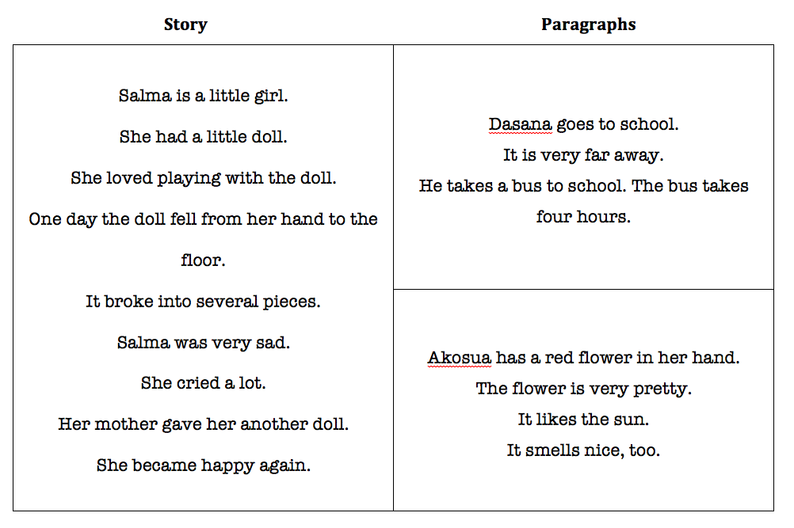
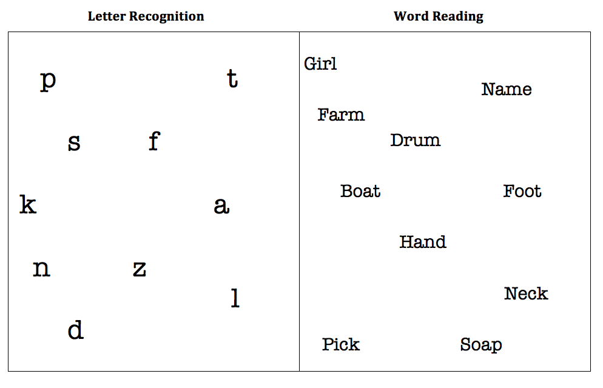

<nav class="navbar navbar-inverse navbar-fixed-bottom" role="navigation">
  

<a class="navbar-brand active" href="index.html">Literacy Report Cards</a>
 <ul class="nav navbar-nav">
 <li><a href="changes.html">Change Over Time</a></li>
<li class="active"><a href="about.html">About</a></li>
</ul></nav>

<h3>Introduction:</h3>

At the Earth Institute at Columbia University, the <a href="http://cgsd.columbia.edu/what-we-do/education/">Education Sector</a> at the Center on Globalization and Sustainable Development and the <a href="http://sel.columbia.edu">Sustainable Engineering Lab</a> at the School of Engineering work together to support the Literacy Report Cards project.

<h3>Mission:</h3>

The goal of the project is to evaluate children's basic reading skills and deliver rapid feedback on their progress to schools and communities. This is achieved through the use of mobile technology, which greatly facilitates data collection.

<h3>How does it work?</h3>

Children are assessed one at a time, and their test results, along with other relevant information (e.g. age, sex, year in school) are recorded on Android-powered mobile phones. These data are then sent electronically to formhub, an open source, survey authoring and data collection platform developed by the Sustainable Engineering Lab. Next, report cards are automatically generated presenting the results of all children assessed, disaggregated by age, sex, or other characteristics. The report cards can then be shared with teachers, school headmasters, parents' groups, other education officials, or the community at large.

The reading test is based on a format used by <a href="http://www.asercentre.org/#2">ASER</a> , in India, and evaluates 4 levels of reading comprehension: letter recognition, word recognition, short paragraph comprehension, and long paragraph (story) comprehension. Tests are administered to children orally by trained enumerators in the presence of the children's classroom teacher and head teacher.

Below is one side of sample test for Ghana. To start, the child is given the paper folded over so that only the paragraphs are visible. If s/he can read the paragraphs easily, s/he flips over the paper to see the story. If s/he can read the story and answer a basic comprehension question, s/he is marked at "story level." If not, s/he is marked at "paragraph level."

If the child cannot read the paragraphs, s/he is shown the second side of the test, with the paper folded so that only the words are visible. If the child can read the majority of the words on the page, s/he is marked at "word level." If not, s/he flips the paper over to see the letters. If the child can recognize the majority of the letters on the page, s/he is marked at "letter level." If not, the child is marked at "no reading level."

<h3>Where has this been done?</h3>

This project was piloted in the Port-à-Piment Watershed Millennium Village in Haiti, in 2012. Current assessment activities are taking place in the Bonsaaso Millennium Village in Ghana. Millennium Villages Project partners with <a href="http://www.uwezo.net/">Uwezo</a> in East Africa (Uganda, Kenya and Tanzania) to get validated tests on basic numeracy and literacy. The Earth Institute uses phones to record data with quick turnaround time. This kind of testing is administered to a small group of students each month as part of regular monitoring and evaluation visits. These test results are also uploaded to formhub.org; and results from Bonsaaso are automatically aggregated on this site.

<h3>Why is this important?</h3>

This project reflects the global shift in international development practice towards focusing on educational quality. Organizations such as ASER and Uwezo already use this kind of testing inform communities of children's baseline reading skills. By adding the use of mobile technology, the Literacy Report Cards project is able to process and share results in a very short amount of time. As communities are informed more quickly and more frequently, they can implement remedial interventions more efficiently. Consequently, children's reading skills are not only evaluated, but improved, as the test results can be used to plan remediation activities catered to the level of the students. This is especially important because children who struggle with reading are often very likely to repeat grades or to drop out of school altogether. By measuring children's progress and addressing their needs frequently, schools can reach these at-risk students who need the most support.

<h3>Further Information</h3>

For a more detailed description of how the Literacy Report Cards project works, you can watch <a href="http://www.youtube.com/watch?v=8XmQXVEy97c">this clip</a>.
For more context about Port-à-Piment pilot and its policy implications for Haiti, you can read <a href="http://cgsd.columbia.edu/files/2013/05/Haiti_literacy_assessment_policy_brief.pdf">this piece</a>.

   

<link rel="stylesheet" href="http://netdna.bootstrapcdn.com/bootstrap/3.0.3/css/bootstrap.min.css" type="text/css" media="screen,projection" />

